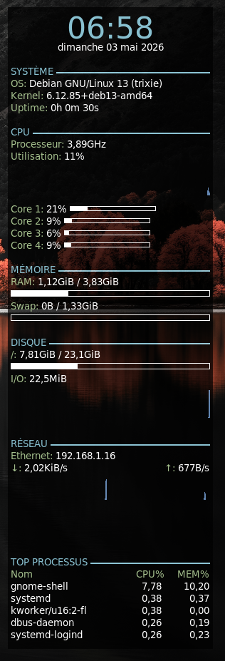
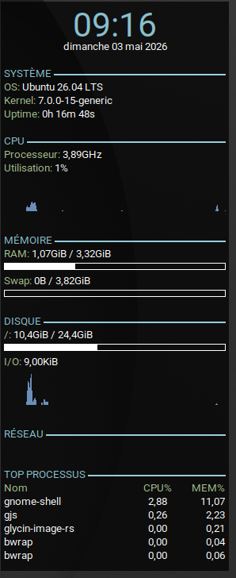
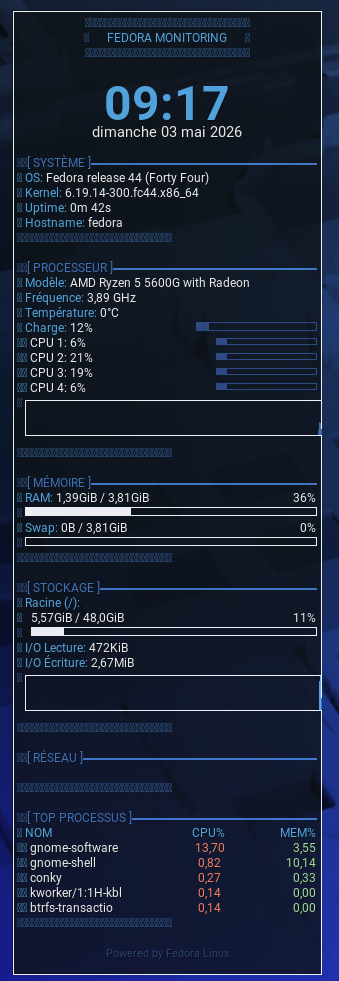

# 🖥️ Conky - Monitoring Système Linux

Configurations Conky avec designs personnalisés pour **Debian 13**, **Ubuntu 26.04** et **Fedora 44**.





---

## ✨ Caractéristiques

- 🔄 **Détection automatique** des CPU et interfaces réseau
- 🎨 **3 designs personnalisés** pour Debian, Ubuntu et Fedora
- 📊 **Monitoring complet** : CPU, RAM, Disque, Réseau, Top processus
- ⚡ **Installation en 1 commande**
- 🚀 **Démarrage automatique** au boot

---

## 🎨 Les 3 Versions

| Distribution | Design | Position | Couleurs |
|--------------|--------|----------|----------|
| 🔴 **Debian 13** | Minimaliste | Droite | Rouge/Gris |
| 🟠 **Ubuntu 26.04** | Nordic | Droite | Bleu/Vert pastel |
| 🔵 **Fedora 44** | Structuré | Gauche | Bleu Fedora + ASCII |

---

## 🚀 Installation

### 🔴 Debian 13

```bash
git clone https://github.com/votre-nom/conky-config.git
cd conky-config
chmod +x install-debian.sh
./install-debian.sh
```

### 🟠 Ubuntu 26.04

```bash
git clone https://github.com/votre-nom/conky-config.git
cd conky-config
chmod +x install-ubuntu.sh
./install-ubuntu.sh
```

### 🔵 Fedora 44

```bash
git clone https://github.com/votre-nom/conky-config.git
cd conky-config
chmod +x install-fedora.sh
./install-fedora.sh
```

---

## 📁 Structure

```
conky-config/
│
├── debian/
│   ├── install-debian.sh
│   ├── conky-debian.conf
│   └── conky-debian.lua
│
├── ubuntu/
│   ├── install-ubuntu.sh
│   ├── conky-ubuntu.conf
│   └── conky-ubuntu.lua
│
└── fedora/
    ├── install-fedora.sh
    ├── conky-fedora.conf
    └── conky-fedora.lua
```

---

## ⚙️ Personnalisation

### Changer la position
```lua
# Dans ~/.conkyrc
alignment = 'top_right',  # top_left, top_right, bottom_left, bottom_right
gap_x = 30,
gap_y = 60,
```

### Modifier la transparence
```lua
own_window_argb_value = 180,  # 0 (transparent) à 255 (opaque)
```

---

## 🎯 Commandes Utiles

```bash
conky &              # Lancer
killall conky        # Arrêter
killall conky && conky &  # Redémarrer
nano ~/.conkyrc      # Éditer
```

---

## 🛠️ Dépannage

### Conky ne démarre pas
```bash
# Debian/Ubuntu
sudo apt install conky-all fonts-roboto

# Fedora
sudo dnf install conky google-roboto-fonts
sudo setsebool -P allow_execheap 1  # Si SELinux bloque
```

### Interface réseau non détectée
```bash
ip link show  # Vérifier vos interfaces
```

### Problème Wayland
```lua
# Dans ~/.conkyrc
own_window_type = 'override',  # Au lieu de 'desktop'
```

---

## 📝 Changelog

### Version 2.0 (2026)
- ✨ Ajout Fedora 44 avec design unique
- 🎨 Trois styles distincts (Debian/Ubuntu/Fedora)
- 🔧 Scripts d'installation automatique

### Version 1.0 (2026)
- 🚀 Version initiale Debian 13
- 🔄 Détection automatique CPU/réseau
- 🎨 Support Ubuntu 26.04

---

## 📜 Licence

MIT License - Libre d'utilisation et de modification

---
